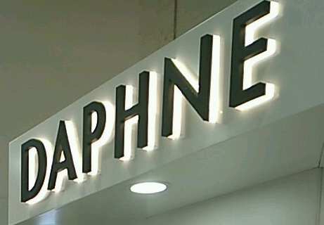

# 百度·西交大 大数据竞赛2018 —— 商家招牌识别

## 赛题简介：训练集~3000，测试集=1000,100分类

## 队伍简介：团队名：parapluie，0.995,10/1085（截至2018/5/29）

## 更新说明

### 1.0.0 @ 2018-5-29，整理前期代码，提供统一的调用入口，提交主办方审核

## 项目说明

### 运行环境

- python 3.6.5

- tensorflow-gpu 1.8.0

- keras 2.1.6

- Pillow 5.1.0

- Numpy 1.14.3

- Pandas 0.23.0

### 数据预处理与数据清洗

- 更正训练集第13类与63类的DQ招牌中错误的部分

- 在比赛初期，根据baseline模型的表现，对一些容易分错的类别进行永久的数据扩增（生成新图像并放入训练路径下）

- 在比赛中期，人工检查出部分test分错的图像（并未进行人工标注及线上提交，仅用于模型分析），发现若干张图像从未被正确分类。如：

这事实上导致了train和test的不同分布，如train中肯德基图像均为红色或白色，显然难以正确预测黄色的肯德基图像；train中daphine图像大多为粉色少女风，模型难以预测灰色色调印刷体的"DAPHINE"




由于主办方未限制自行采集数据，我们从网络上有针对性地收集了一些图像，也放入了训练集中。

- 随机划分train与val，基于sklearn的train_test_split（划分代码可见Utils.py）

- 将train数据由train/xxxxx.jpg移动至train/[classID]/xxxxx.jpg，以便keras的图像生成器进行读取

### 模型介绍

- 以迁移学习为主，结合图像特性修改模型结构，使用特征工程等竞赛技巧进行优化。

- 整个比赛过程中，使用了DenseNet201，InceptionResNetV2，ResNet50，Xception，InceptionV3，NasNetMobile等网络，均来自于keras.application。

- 上述模型均以imagenet预训练权值为基础进行迁移学习

- 如数据预处理部分所述，针对难以正确分类的图像，我们分析了它们的共同点。认为应当引入灰度图像信息（如黄色KFC图像在灰度下与红色KFC差异不大）。但单纯将三通道RGB降为单通道，不便于模型训练，且违背了为模型提供更多信息的初衷。因此我们将所有迁移模型的输入均改造为(W,H,3+1)的形状，通道维由RGB及Gray组成。

- 经实际线上检验，上述操作对大部分迁移模型，能提升1个百分点以上的正确率

- 在前期及中期尝试中，我们积累了较多的提交结果。在历史提交结果的基础上，我们使用多数投票的方法，生成新的提交结果。随着模型的进一步优化，支撑投票的基础结果的正确率的提高，投票结果的正确率也随之提高。最终达到了目前0995（截至2018-05-29）的线上成绩。

### 代码介绍及Usage

Note：虽然我们提供了训练权值及相关训练、测试代码，但由于我们对训练数据做了补充，且我们划分的val源自一次随机划分。可能导致在原始数据下重新训练和预测的精度与我们的线上成绩有所出入。

#### 训练

- Usage: ```python3 Train.py --channel=3 --modelType=densenet```

- 参数说明：channel：3或4，默认为3.指定使用RGB还是RGB+Gray；modelType从["densenet", "InceptionResNetV2", "Resnet", "xception", "inception", "nas"]中选择

- 训练说明：先在3通道下完成Imagenet到竞赛数据的迁移（训练至earlystop或val_acc=1），代码会自动保存best_checkpoint；再在4通道下训练至earlystop。

- 训练说明：我们使用了三个callback来确保模型达到最佳拟合状态而没有过拟合：EarlyStopping,ModelCheckpoint,ReduceLROnPlateau

#### 预测

- Usage ```python3 Test.py --channel=4 --modelType=densenet```

- 参数说明：与train部分参数意义相同，但这里channel默认为4

- 预测说明：正确设定test数据路径后，在当前目录下生成一个result.csv

- <b>注意事项</b>：请注意，我们在训练过程中使用了keras的图像生成器及其flow_from_directory()方法。该方法将自动读取路径下的所有文件夹（即名为1至100的100个文件夹）。但是该工具会按照字符顺序对类别id进行排序。这就导致喂给模型的第"10"类，不是主办方提供数据的第10类。产生了数据错位。

- 这也是Test.py中class_indices的作用。如果在运行过程中发现标签错位情况，考虑重新检查Train.py/train_generator.class_indices

#### 特征工程及模型融合

- Usage ```python3 result_vote.py```

- 使用说明：脚本中包含历次vote使用的文件列表，操作流程为，使用文件列表进行投票，线上提交，产出结果后修改标记文件名。

- 说明：由于我们使用的模型数量较多，而机器性能有限。无法做模型级别的模型融合，只好使用这种多数投票的方法，来模拟多模型融合。

#### 其它代码文件注释

- Model.py 包含了所有使用的迁移模型。在尝试过程中，我们还尝试了[空间变换网络(Spatial Transform Networks, STN)](https://arxiv.org/abs/1506.02025)，试图校正不在图像中心的招牌。但经检验效果并不理想，因此废弃。

- Utils.py 包含为预测生成数据的生成器TestGen，以及比赛初期随机划分train/val的划分工具